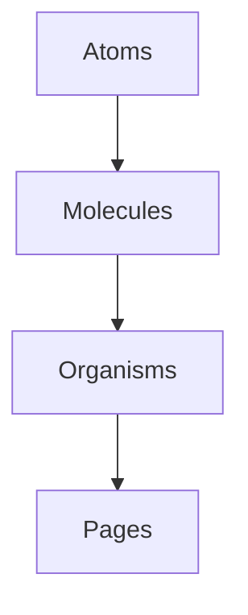

<p align="center">
  
</p>

<h1 align="center">🚀 RocketList</h1>

<p align="center">
  A stunning, scalable task manager built to demonstrate the power of Atomic Design in Flutter.
</p>

<p align="center">
  <a href="https://flutter.dev">
    
  </a>
  <a href="https://supabase.com">
    
  </a>
</p>

---
<div id="english-version"></div>

### ⚡ About The Project

RocketList is a modern and robust task & project management application designed to streamline personal organization. Built with **Flutter**, it delivers a smooth, native experience on both **iOS** and **Android**.

The main goal of this project is to fight **Spaghetti Code**. By enforcing **Atomic Design architecture** and leveraging **Supabase Auth + Row Level Security (RLS)**, RocketList proves that an app can be beautiful, scalable, and secure.

---

### 📱 App Preview

### Login & Auth
<p align="left">
  
</p>

---

### Project Dashboard
<p align="left">
  
</p>

---

### Task Management
<p align="left">
  
</p>
 


---

### 🌟 Key Features

- 🔐 **Iron-Clad Security** — Supabase Auth + Row Level Security  
- 🎨 **Atomic UI** — Atoms, Molecules & Organisms  
- 📂 **Smart Projects** — Custom icons and colors  
- ✅ **Power Tasking** — Due dates, completion & overdue alerts  
- 👋 **Swipe Actions** — Native gestures with confirmations  
- 🌑 **Modern UX** — Empty states, splash screens & loaders  

---

### 🏗️ Architecture: Atomic Design

RocketList breaks the UI into fundamental building blocks:



### 📂 Directory Structure

```text
lib/
├── widgets/
│   ├── atoms/       # 🧱 Basic UI blocks
│   ├── molecules/   # 🔗 Combined components
│   └── organisms/   # 🧠 Complex sections
├── pages/           # 📱 Full screens
├── models/          # 📦 Data models
├── repositories/    # 📡 Supabase logic
└── core/            # 🎨 Constants & themes
```

<h2>🛠️ Tech Stack</h2>

<table style="width:100%; border-collapse: collapse;">
  <thead>
    <tr style="background:#222; color:#fff;">
      <th align="left">Component</th>
      <th align="left">Technology</th>
      <th align="left">Used For</th>
    </tr>
  </thead>
  <tbody>
    <tr>
      <td>Framework</td>
      <td>Flutter</td>
      <td>Cross-platform UI</td>
    </tr>
    <tr>
      <td>Language</td>
      <td>Dart</td>
      <td>App Logic</td>
    </tr>
    <tr>
      <td>Backend</td>
      <td>Supabase</td>
      <td>Auth, Database, RLS</td>
    </tr>
    <tr>
      <td>State</td>
      <td><code>StatefulWidget</code></td>
      <td>Clean & Native State Management</td>
    </tr>
    <tr>
      <td>Packages</td>
      <td><code>intl</code>, <code>flutter_slidable</code></td>
      <td>Date formatting & Gestures</td>
    </tr>
  </tbody>
</table>

### 🧠 Skills Demonstrated

This project highlights my ability to build scalable applications with software engineering best practices:

1. Clean Architecture: Strict separation between Business Logic (Repositories), Data (Models), and UI (Atomic Widgets).

2. Backend Security: Implementation of Row Level Security (RLS) in PostgreSQL to ensure data privacy.

3. Async Handling: Efficient management of Futures, StatefulBuilder, and runtime error handling.
   

### 🚀 Getting Started

Clone the repository

```bash
git clone https://github.com/FelixMGZ/RocketList.git
cd RocketList
```

### Install dependencies
```bash
flutter pub get
```

### Configure Supabase

Create `lib/core/constants.dart`:

```dart
class AppConstants {
  static const String supabaseUrl = 'YOUR_SUPABASE_URL';
  static const String supabaseAnonKey = 'YOUR_SUPABASE_ANON_KEY';
}
```
### Run the app

```bash
flutter run
```
<div align="center">

### 📄 License

Distributed under the MIT License. See LICENSE for more information.

### 🤝 Contributions are welcome!

Built with 💙 by FELIX MARTINEZ G.

</div>


